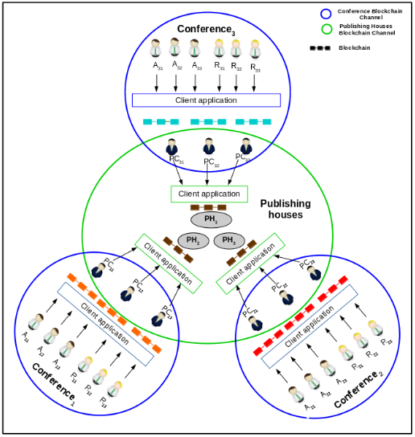
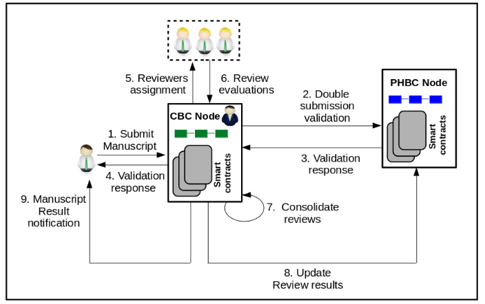

# MaRSChain: Framework for a Fair Manuscript Review System Based on Permissioned Blockchain

MaRSChain is a framework to build decentralized manuscript review system based on permissioned blockchain. MaRSChain guarantees fairness and detects double and concurrent submissions of a manuscript. MaRSChain is a network of multiple mutually segregated permissioned blockchains. In particular, individual forums maintain independent blockchain systems (referred to as *Conference Blockchains, CBCs*) with their respective program chairs as validating nodes, and a blockchain network (referred to as *Publishing House Blockchain, PHBC*) with publishing houses as validating nodes. The CBCs have a list of manuscripts submitted to their respective forums, and the PHBC has a list of publications that are already published in all the forums in the past, along with the list of manuscripts currently under review at all forums.

**MaRSChain Architecture**



For detailed description of MaRSChain framework, please refer [MaRSChain: Framework for a Fair Manuscript Review System Based on Permissioned Blockchain](https://wiki.hyperledger.org/_media/groups/requirements/use-case-inventory/marschain_usecase_hl.pdf).

This document demonstrates MaRSChain framework implemented on Hyperledger Fabric v1.1.0-preview platform.

## Prerequisites

* [Docker](https://www.docker.com/products/overview) - v1.12 or higher
* [Docker Compose](https://docs.docker.com/compose/overview/) - v1.8 or higher
* [Git client](https://git-scm.com/downloads) - needed for clone commands
* [Node.js v8.4.0 or higher](https://nodejs.org/en/blog/release/)
* [Download Docker images](http://hyperledger-fabric.readthedocs.io/en/release-1.1/samples.html) - v1.1.0-preview images


## Clone Repository
Clone the repository (tag v1.1.0-preview) using the following commands
```
git clone https://github.com/hyperledger/fabric-samples.git
cd fabric-samples/MaRSChain/
```

Existing *fabric-samples/balance-transfer* application Node JS [code](https://github.com/hyperledger/fabric-samples/tree/v1.1.0-preview/balance-transfer) is modified based on MaRSChain requirement to support endorsements from multiple organizations within the same channel.

### Directory Structure
```
├── app							Fabric GRPC interface
├── app.js                      CBC Node.js application
├── app_phbc.js                 PHBC Node.js application
├── artifacts 					Certificates used for Fabric network configuration
	├── src/github.com          Chaincodes
		├── conference_cc       Conference chaincode source
		├── publishinghouse_cc  Publishing house chaincode source
	├── channel                 Artifacts configuration files
		├── crypto-config       Certificates and keys for orderer and peers
├── config.{js,json}            CBC application configuration settings
├── configphbc.{js,json}        PHBC application configuration settings
├── clean.sh                    Teardown the network,cleanup containers & key stores
├── runApp.sh 			        Network launch script
├── testAPIs_cbc.sh             CBC channel and chaincode setup script
├── testAPIs_phbc.sh            PHBC channel and chaincode setup script
├── scripts                     MaRSChain test scripts
    ├── assign_reviewers_CBC.sh 	  Assign reviewers in CBC
    ├── bootstrap_manuscripts_PHBC.sh Bootstapping Manuscripts in PHBC
    ├── final_decision_CBC.sh         Conference publication result
    ├── manuscript_validation.sh      Manuscript validation in CBC
    ├── query_CBC.sh                  Query manuscript info in CBC
    ├── query_PHBC.sh				  Query manuscript info in PHBC
    ├── query_status_PHBC.sh          Query manuscript status in PHBC
    ├── restAPIs.sh                   CBC and PHBC  REST functions
    ├── submit_evaluation_CBC.sh      Submit reviewer evaluations in CBC
    ├── submit_papers_CBC.sh          Submit manuscripts to CBC
    ├── update_status_PHBC.sh         Update CBC publications to PHBC
```

## MaRSChain Network Setup

MaRSChain repository comes with a sample Hyperledger Fabric(HLF) blockchain network configuration to start. The HLF network consists of two channels (*CBC* and *PHBC*), eight organizations, two peers per organization, one Certificate Authority(CA) per organization, and a single Solo ordering service. The network supports automatic provisioning of cryptographic material for peer and orderer organizations, automatic provisioning of channel artifacts, and channel joining by participating organizational peers. Crypto material for all the identities in both the channels is available in the *artifacts* directory. For more details, refer *Artifact (certificates, genesis block and channel configuration info)* in Appendix.

The provisioned HLF network(v1.1.0-preview configuration) consists of the following docker containers:

* 8 Organizations (4 Organizations per channel)
	* Organization names in CBC channel  - *PC1, PC2, PC3, PC4*
   	* Organization names in PHBC channel - *IEEE, Springer, Elsevier, ACM*
* 8 CAs (1 CA per Organization)
* A single Solo ordering service (common to both channels)
* 16 Peers (2 peers per Organization, out of which 1 is an endorsing peer)
* 8 Couchdb (1 service per each endorsing peer)

## Running the MaRSChain application

### 1. Start the HLF network, CBC and PHBC node applications

Launch Terminal Window 1 and execute the following commands:

```
cd fabric-samples/MaRSChain
./runApp.sh
```

The runApp.sh will

- Clean up all existing docker containers and chaincode images
- Launch the required BC network on your local machine (using docker-compose tool)
- Execute `npm install` command to install `node-modules` dependencies
- Start CBC and PHBC node servers on PORT 4000 and 4001 respectively

The docker containers automatically create a local network that is based on the name that was specified inside *artifacts/docker-compose.yaml*. 
For more details on docker and docker-compose, please refer *Docker and Docker-Compose* in Appendix. Once you have completed the above setup, use `docker ps` to view all the containers. For complete list of containers, please refer section 'MaRSChain Network Setup'.

After running of the server you should see the following output in console:
```
debug: Successfully constructed a winston logger with configurations debug=console
debug: Successfully constructed a winston logger with configurations debug=console
[INFO] SampleWebApp - ****************** SERVER STARTED ************************
[INFO] SampleWebApp - ***************  http://localhost:4001  ******************
[INFO] SampleWebApp - ****************** SERVER STARTED ************************
[INFO] SampleWebApp - ***************  http://localhost:4000  ******************
```

### 2. CBC and PHBC Blockchain setup

#### 2.1. Conference Blockchain(CBC) setup

Launch Terminal Window 2 and execute the following commands:

```
cd fabric-samples/MaRSChain
./testAPIs_cbc.sh
```

For the following shell scripts(testAPIs\_cbc.sh and testAPIs\_phbc.sh) to properly parse the JSON, you must install `jq`. For instructions, please refer [jq](https://stedolan.github.io/jq/).

The testAPIs_cbc.sh will

- Enroll users in each of the CBC Organizations – *PC1, PC2, PC3, PC4*
- Create a new channel (*conferenceonechannel*)
- Join peers to the channel (8 peers - 2 per Organization)
- Install *conference* chaincode on peer's filesystem
- Instantiate *conference* chaincode on *conferenceonechannel* channel.

*CBC Tokens (JWT authorization tokens):*
Enroll response contains the success/failure status, an *enrollment Secret*, and a *JSON Web Token (JWT)*. The *JWT* is an authorization token required in the *Request Headers* for subsequent(create and join channel, install, instantiate, invoke and query chaincode) requests on CBC.

**NOTE:** A user enrolling in one organization can send (invoke/query) requests to other organizations within the same blockchain network (channel). So any one of the authorization tokens (*PC1/PC2/PC3/PC4*) can be used for subsequent invoke/query requests within the same CBC network.

*CBC chaincode containers:*
After running the script, use `docker ps | grep conferenceCC` to view *conference* chaincode containers. The chaincode containers will have status as *running*:

```
dev-peer0.pc1.example.com-conferenceCC-v0			dev-peer0.pc4.example.com-conferenceCC-v0
dev-peer0.pc3.example.com-conferenceCC-v0			dev-peer0.pc2.example.com-conferenceCC-v0
```

*CBC Endorsement Policy:*
Endorsement policy describes the conditions on which a transaction can be endorsed. A transaction can only be considered valid if it has been endorsed according to its policy. Each chaincode is deployed with an endorsement policy at the time of chaincode instantiation on the channel. For more details on endorsement policy for CBC, please refer *Endorsement Policy* in Appendix.

Now the *conference* chaincode is ready to take invoke/query requests in CBC.

#### 2.2. Publishing House Blockchain(PHBC) setup

Launch Terminal Window 3 and execute the following commands:

```
cd fabric-samples/MaRSChain
./testAPIs_phbc.sh
```

The testAPIs_phbc.sh will

- Enroll users in each PHBC Organizations – *IEEE, Springer, Elsevier, ACM*
- Create a new channel (*phbcchannel*)
- Join peers to the channel (8 peers - 2 per organization)
- Install *publishing house* chaincode on peer's filesystem
- Instantiate *publishing house* chaincode on *phbcchannel* channel.

*PHBC Tokens (JWT authorization tokens):*
Enroll response contains the success/failure status, an *enrollment Secret* and a *JSON Web Token (JWT)*. The *JWT* is an authorization token required in the *Request Headers* for subsequent(create and join channel, install, instantiate, invoke and query chaincode) requests on PHBC.

**Note:** A user enrolling in one organization can send (invoke/query) requests to other organizations within the same blockchain network (channel). Hence, any one of the authorization tokens (*IEEE, Springer, Elsevier, and ACM*) can be used for subsequent invoke/query requests within the same PHBC network.

*PHBC chaincode containers:*
After running the script, use `docker ps | grep phbcCC` to list all the *publishing house* chaincode containers. In our case, you should see the following four containers executing and having status as *running*:

```
dev-peer0.ieee.example.com-phbcCC-v0		dev-peer0.acm.example.com-phbcCC-v0
dev-peer0.springer.example.com-phbcCC-v0    dev-peer0.elsevier.example.com-phbcCC-v0
```

*PHBC Endorsement Policy:*
Endorsement policy describes the conditions on which a transaction can be endorsed. A transaction can only be considered valid if it has been endorsed according to its policy. Each chaincode is deployed with an endorsement policy at the time of chaincode instantiation on the channel. For more details on endorsement policy for PHBC, please refer *Endorsement Policy* in Appendix.

Now the *publishing house* chaincode is ready to take invoke and query requests in PHBC.

### 3. Operational Flow of MaRSChain System


#### 3.1 Bootstrap Manuscripts into PHBC

Launch Terminal Window 4 and execute the following command:

The **bootstrap_manuscripts_PHBC.sh** script contains REST API requests to bootstrap manuscripts with various statuses(*submitted, rejected, and accepted*) in to PHBC.

```
cd fabric-samples/MaRSChain/scripts

./bootstrap_manuscripts_PHBC.sh <IEEE TOKEN> <Springer TOKEN> <ACM TOKEN>
```

Here, *{IEEE,Springer,ACM}\ TOKEN* is the *JSON Web Token (JWT)* received as response to enroll request. For tokens, check output of script in Terminal Window 3.

Wait for sometime to complete bootstrapping of all nine manuscripts.

**Output:**
```
PHBC Manuscript Transaction ID for all 9 manuscripts
```

After successful execution of *bootstrap_manuscripts_PHBC.sh*, out of nine manuscripts:
* First three manuscripts will have *submitted* status,
* Next three manuscripts will have *rejected* status and
* Last three manuscripts will have *accepted* status.

The following table summarizes different manuscript statuses

| Manuscript ID | Manuscript Status | Description |
|:------------|:-------------|:--------------------------------------|
| 1 − 3 | *submitted* | Already submitted to a forum and is under-review |
| 4 − 6 | *rejected*  | Submitted earlier but rejected at a forum |
| 7 − 9 | *accepted*  | Already published at a forum |

To check the status of current submissions use **query_status_PHBC.sh** script. Refer *Query Manuscripts Status in PHBC* section for execution details.

#### 3.2 Query Manuscripts Status in PHBC

The **query_status_PHBC.sh** script contains REST API request to query all manuscripts statuses in PHBC.

```
./query_status_PHBC.sh <{IEEE/Springer/Elsevier/ACM} TOKEN> <No_of_Manuscripts>
```
For tokens, refer to the output of *testAPIs_phbc.sh* script in Terminal Window 3.

#### 3.3 Query Manuscripts in PHBC

The **query_PHBC.sh** script contains REST API request to query all PHBC manuscripts details(paperID, program chair, paper status).

```
./query_PHBC.sh <{IEEE/Springer/Elsevier/ACM} TOKEN>
```

For tokens, refer to the output of *testAPIs_phbc.sh* script in Terminal Window 3.

#### 3.4 Submit Manuscripts to CBC

Each conference/forum maintains independent blockchain systems referred to as Conference Blockchains (CBCs). The statuses of the manuscripts in CBC are described in the following table

|Status|Description|
|:-------|:--------------------------------------|
|*under-submission*  |Accepted by the forum for consideration  |
|*submitted* 	     |Accepted for review by the forum, after double/concurrent submission validation  |
|*under-review*      |Assigned to the reviewers for evaluation|
|*accepted* 	     |Accepted by the forum for publishing|
|*rejected* 	     |Rejected by the forum  |

Manuscripts submission in CBC is performed by executing **submit_papers_CBC.sh** script. To check all possible cases (double/concurrent submission), give 12 for *No_of_manuscripts* argument.

```
./submit_papers_CBC.sh <{PC1/PC2/PC3/PC4} TOKEN> <No_of_manuscripts>

For example : ./submit_papers_CBC.sh <PC1 TOKEN> 12
```
Here *PC1 TOKEN* is the *JSON Web Token (JWT)* received as response to the enroll request. For token, refer to the output of **testAPIs_cbc.sh** script in Terminal Window 2.

**Output:**
```
CBC Manuscripts Transaction IDs are displayed
```

In CBC, initially all submissions will have status as *under-submission*. Manuscript details like programchair, reviewers list, reviewer score, and final decision details will not be available. These submissions are validated by *publishing house* chaincodes to detect double and concurrent submissions. For manuscript validation details, refer Section 8 of 'Manuscripts Validation'.

To check the status of all manuscripts, use **query_CBC.sh** script. Refer section 'Query Manuscripts in CBC' for execution details.

#### 3.5 Query Manuscripts in CBC
The **query_CBC.sh** script contains REST API request to query CBC submissions. The manuscript details like author names, paper id, programchair, paper status, reviewers list, reviewer score, and final decision will be displayed.

```
./query_CBC.sh <{PC1/PC2/PC3/PC4} TOKEN> <No_of_manuscripts>

For example: ./query_CBC.sh <PC1 TOKEN> 12
```

For token, refer to the output of **testAPIs_cbc.sh** script in Terminal Window 2.

#### 3.6 Manuscripts Validation (Double and/or Concurrent submission check) in CBC
Manuscripts Validation (Double and/or Concurrent submission checks) in CBC is performed by executing **manuscript_validation.sh** script. The script contains REST API requests to query PHBC and invoke CBC for validating CBC manuscripts.

```
./manuscript_validation.sh <{PC1/PC2/PC3/PC4} TOKEN> <{IEEE/Springer/Elsevier/ACM} TOKEN> <No_of_Manuscripts>

For example: ./manuscript_validation.sh <PC1 TOKEN> <IEEE TOKEN> 12
```

For *PHBC TOKEN*, refer to the output of *testAPIs_phbc.sh* script in Terminal Window 3 and for *CBC TOKEN*, refer to the output of **testAPIs_cbc.sh** script in Terminal Window 2.

**Output:**
```
CBC and PHBC manuscripts Transaction IDs
```

After manuscript validation in CBC, the status will be updated from *under-submission* to *manuscript rejected - concurrent submission* (or) *manuscript rejected - double submission* (or) *submitted* based on manuscript status in PHBC. Refer the following table for detailed description

| Manuscript Status in PHBC | CBC Manuscript Status after Validation | Validation Description | PHBC Manuscript Status after Validation |
| ------------- |  ---------------- | --------------------------- |-------------- |
| *accepted* | *manuscript rejected - double submission* | Rejected for review by the forum – manuscript is already accepted by some other forum | No change in status |
|  |  |  |
| *submitted* | *manuscript rejected - concurrent submission* | Rejected for review by the forum – manuscript is accepted for review by some other forum | No change in status |
|  |  |  |
| *rejected* | *submitted* | Accepted for review by the forum after double/concurrent submission validation – Manuscript submitted earlier and got rejected by some forum  | *submitted* |
|  |  |  |
| Manuscript Not Available  | *submitted*  | Accepted for review by the forum after double/concurrent submission validation  - Manuscript submitted newly/afresh | *submitted* |


In PHBC, verify the status of manuscripts by executing **query_PHBC.sh** or **query_status_PHBC.sh** script. Refer sections 'Query Manuscripts Status in PHBC' or 'Query Manuscripts in PHBC'.

In CBC, verify the status of the given manuscripts using **query_CBC.sh** script. Refer section 'Query Manuscripts in CBC' for details. In this step, manuscript details like programchair, reviewers list, reviewer score, and final decision details will not be available.


#### 3.7 Assign Reviewers for Manuscripts in CBC

Once the manuscript acceptance window is closed, the Program Chairs (PCs) reach consensus on assigning the submitted manuscripts to reviewers for evaluation. For ease of implementation, we assume that this consensus is an offline process and all the Node/PCs in CBC have agreed to the decision on reviewers assignment offline. Reviewers are assigned only for the manuscripts with status `submitted` in CBC.

The **assign_reviewers_CBC.sh** script contains REST API request to assign reviewers for manuscript evaluation in CBC.

```
./assign_reviewers_CBC.sh <{PC1/PC2/PC3/PC4} TOKEN> <No_of_Manuscripts>

For example: ./assign_reviewers_CBC.sh <PC1 TOKEN> 12
```

**Output:**
```
CBC Manuscripts Transaction IDs are displayed
```

Check the status of the given manuscripts using **query_CBC.sh** script. Refer section 'Query Manuscripts in CBC' for details. In this step, manuscript details like programchair, reviewers list will be included and manuscript status will be modified from *submitted* to *under-review*. The details like reviewer score, and final decision details are not available.


#### 3.8 Manuscript Evaluation Results in CBC

Reviewers evaluate the assigned manuscript and submit their evaluations as transactions to CBC. An evaluation is a score given to the manuscript by the reviewer. The **submit_evaluation_CBC.sh** script contains REST API request to submit reviewer evaluation score for assigned manuscript.

```
./submit_evaluation_CBC.sh {PC1/PC2/PC3/PC4} TOKEN

For example: ./submit_evaluation_CBC.sh <PC1 TOKEN>
```

**Output:**
```
Returns Manuscripts Transaction ID
```

Check the status of the given manuscripts using **query_CBC.sh** script. Refer section 'Query Manuscripts in CBC' for details. In this step, individually reviewers will record their scores for the assigned manuscript.


#### 3.9 Manuscript Final Result Decision and Notification

On receiving all the reviewers evaluations for a manuscript, the scores are consolidated by executing **final_decision_CBC.sh** script.
The scores reflect the final decision of the conference. These scores are then notified to the authors. This script contains REST API request to consolidate the scores given by assigned reviewers.

```
./final_decision_CBC.sh <{PC1/PC2/PC3/PC4} TOKEN>

For example: ./final_decision_CBC.sh <PC1 TOKEN>
```

**Output:**
```
CBC Manuscript Consolidation Transaction ID is returned
```

Check the status of the given manuscripts using **query_CBC.sh** script. Refer section 'Query Manuscripts in CBC' for details. In this step, *finalDecision* will be updated with the consolidated score. Manuscript publication result *accepted/rejected* will be decided based on the consolidated score value. Refer following table for details

| Consolidated score | Manuscript status
| --------- | --------- |
| >= 3 	    | `accepted`  |
| <\ 3      | `rejected`  |


#### 3.10 Update CBC Manuscript Publication result in PHBC
Once the manuscript publication results are declared, the PHBC has to be updated about the results of the CBC manuscripts.

Updation of manuscripts status in PHBC is done by executing **update_status_phbc.sh** script. The script contains REST API request to invoke PHBC chaincode to update CBC manuscript final status in PHBC

```
./update_status_PHBC.sh <{PC1/PC2/PC3/PC4} TOKEN> <{IEEE/Springer/Elsevier/ACM} TOKEN>

For example: ./update_status_PHBC.sh <PC1 TOKEN> <IEEE TOKEN>
```

**Output:**
```
PHBC Manuscript Transaction IDs are returned
```

Check status of PHBC manuscripts using **query_PHBC.sh** or **query_status_PHBC.sh** script. Refer sections 'Query Manuscripts Status in PHBC' or 'Query Manuscripts in PHBC'.

In PHBC, the status of the manuscripts will be updated from *submitted* to *accepted/rejected* based on CBC manuscript publication result. For CBC manuscript publication decision refer section 'Manuscript Final Result Decision and Notification'.


### 4. Network Cleanup
There are two options available for teardown of the network, cleanup the stores and clean the containers and intermediate images.

*Option 1:*

```
cd MaRSChain

./cleanup.sh

```

The cleanup.sh will

- Teardown the network, cleanup the stores
- Clean up docker containers and chaincode images

*Option 2:*

```
cd MaRSChain

docker-compose -f artifacts/docker-compose.yaml down

rm -rf fabric-client-kv-* /tmp/fabric-client-kv-*

docker rm -f $(docker ps -aq)

docker rmi -f $(docker images | grep ``dev|none|test-vp|peer[0-9]-'' | awk '{print $3}')

```

### Troubleshooting
1. If you have existing containers running, you may receive an error indicating that a port is already occupied. If this occurs, you will need to kill the container that is using said port (or) execute *MaRSChain/cleanup.sh* script.
2. If you are receiving timeout or GRPC communication errors, make sure you have the correct version of Docker installed. Then try restarting your failed docker process using `docker stop <container_name>`.
3. Another approach to GRPC and DNS errors (peer failing to resolve with orderer and vice versa) is to hardcode the IP addresses for each.
To ascertain the IP address use `docker inspect <container_name> | grep IPAddress`. In *artifacts/docker-compose.yaml* file, take these values and hard code them to `CORE_PEER_COMMITTER_LEDGER_ORDERER=<IP_ADDRESS> CORE_PEER_ADDRESS=<IP_ADDRESS>`.
4. If you are seeing errors while using the node SDK, make sure you have the correct versions of node.js and npm installed on your machine. You want node v8.4.0 and npm v5.3.0.
5. If you see "Error: Got unexpected status: BAD_REQUEST" error while creating channel, you will need to execute *MaRSChain/cleanup.sh* script.
This error occurs because you are attempting to create a channel which already exists.
6. If a file cannot be located, make sure you are in the directory where you pulled the source code.

## Appendix

### Artifact (certificates, genesis block and channel configuration info)

For any organization to be included in the channel, it must be defined in a consortium in the orderer system channel.
In the *artifacts/channel/configtx.yaml* file, define consortium's prior to bootstrapping the network. However, you may define consortium's and change their membership dynamically through channel config update transactions. More details are available [here](http://hyperledger-fabric.readthedocs.io/en/v1.1.0-alpha/channel_update.html).

Crypto material has been generated using the **cryptogen** tool from Hyperledger Fabric and mounted to all peers, the orderering node and CA containers.

To generate certificates for all the identities, run the following command:

```
cryptogen generate --config=cryptogen.yaml
```
More details regarding the cryptogen tool are available [here](http://hyperledger-fabric.readthedocs.io/en/latest/build_network.html#crypto-generator).

An Orderer genesis block (marschainorderergenesis.block) and channel configuration transaction for CBC (conferenceonechannel.tx) and PHBC (phbcchannel.tx) has been pre-generated using the **configtxgen** tool from Hyperledger Fabric and placed within the *artifacts* folder.


To create orderer genesis block, run the following commands
```
export FABRIC_CFG_PATH=$PWD
configtxgen -profile MaRSChainOrdererGenesis -outputBlock marschainorderergenesis.block
```

After creating the orderer genesis block, it is a time to create channel configuration transaction.
To create ConferenceOne Channel configuration transaction, run the following command
```
configtxgen -profile ConferenceOneChannel -outputCreateChannelTx conferenceonechannel.tx -channelID conferenceonechannel
```

To create PHBC Channel configuration transaction, run the following command
```
configtxgen -profile PhbcChannel -outputCreateChannelTx  phbcchannel.tx -channelID phbcchannel
```
More details regarding the configtxgen tool are available [here](http://hyperledger-fabric.readthedocs.io/en/latest/build_network.html#configuration-transaction-generator).

### Docker and Docker-Compose
Docker is a tool for deploying, executing, and managing containers. Hyperledger Fabric is by default packaged as a set of Docker images and it is ready to be run as Docker containers.

Docker Compose is a tool for defining and running multi-container Docker applications. Docker Compose is typically installed as a part of Docker installation. If not, it is necessary to install it separately. Docker compose uses a docker-compose.yml file as default input file. Docker compose file is a YAML file defines services, networks, and volumes. A service definition contains configuration which will be applied to each container started for that service. The default path for a compose file is *artifacts/docker-compose.yaml*. For docker compose file, you can use either *.yml* or *.yaml* extension.

### Endorsement Policy
Endorsement policy describes the conditions on which a transaction can be endorsed. A transaction can only be considered valid if it has been endorsed according to its policy. Each chaincode is deployed with an endorsement policy at the time of chaincode instantiation on the channel.

To consider endorsements from multiple organizations within the same network, we have modified the existing *balance-transfer* Node JS code such that it supports multiple endorsements. Created endorsement policy patch file *(MaRSChain/endorsements_policy_changes.txt)* with all the modifications as per MaRSChain requirements.

*Endorsement policy for publishing house chaincode:*
Requiring endorsements from three peers of three different organizations out of four within the channel are required.

For Publishing Houses Blockchain (PHBC), inside PHBC node application*(app_phbc.js)*, the following endorsement policy condition is included in
instantiate chaincode

```
            var epolicy = {
                identities: [
                    { role: { name: ``member'', mspId: ``IEEEMSP'' }},
                    { role: { name: ``member'', mspId: ``SpringerMSP'' }},
                    { role: { name: ``member'', mspId: ``ElsevierMSP'' }},
                    { role: { name: ``member'', mspId: ``ACMMSP'' }}
                ],
                policy: {
                    ``3-of'': [{ ``signed-by'': 0 }, { ``signed-by'': 1 }, { ``signed-by'': 2 }, { ``signed-by'': 3 }]
                }
                };
            }}
```

This endorsement policy(epolicy) condition need to be specified as part of chaincode instantiate request when sending proposal to endorser *(in MaRSChain/app/instantiate-chaincode.js file)*.

```
                var request = {
                            chaincodeId: chaincodeName,
                            chaincodeType: chaincodeType,
                            chaincodeVersion: chaincodeVersion,
                            args: args,
                            txId: tx_id,
                            ``endorsement-policy'': epolicy
                    };
                }}
```


*Endorsement policy for conference chaincode:*
Requiring endorsements from three peers of three different organizations out of four within the channel are required.

For Conference Blockchain(CBC), inside CBC node application*(app.js)* included the following endorsement policy condition in instantiate chaincode
```
			var epolicy = {
				identities: [
					{ role: { name: ``member'', mspId: ``PC1MSP'' }},
					{ role: { name: ``member'', mspId: ``PC2MSP'' }},
					{ role: { name: ``member'', mspId: ``PC3MSP'' }},
					{ role: { name: ``member'', mspId: ``PC4MSP'' }}
				],
				policy: {
				    ``3-of'': [{ ``signed-by'': 0 }, { ``signed-by'': 1 }, { ``signed-by'': 2 }, { ``signed-by'': 3 }]
				}
			    };
			}}
```

This endorsement policy(epolicy) condition  need to be specified as part of chaincode instantiate request when sending proposal to endorser *(in MaRSChain/app/instantiate-chaincode.js file)*.

<a rel="license" href="http://creativecommons.org/licenses/by/4.0/"></a><br />This work is licensed under a <a rel="license" href="http://creativecommons.org/licenses/by/4.0/">Creative Commons Attribution 4.0 International License</a>.
